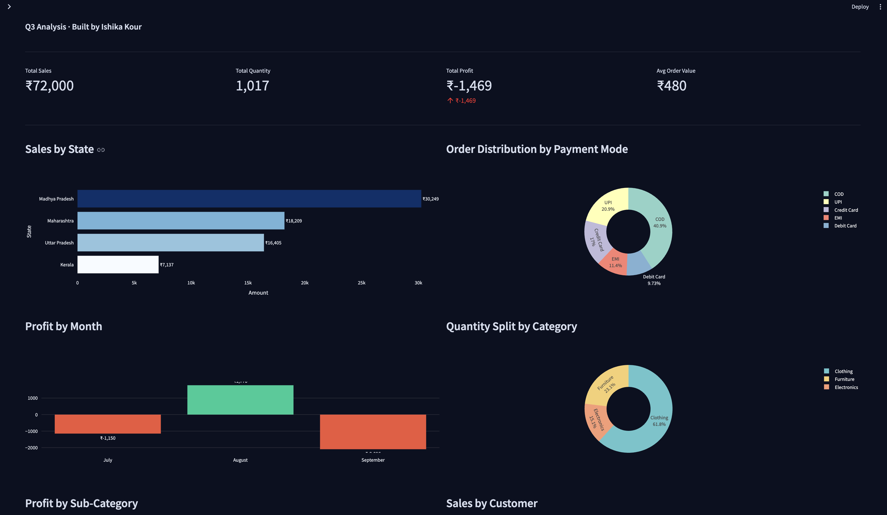
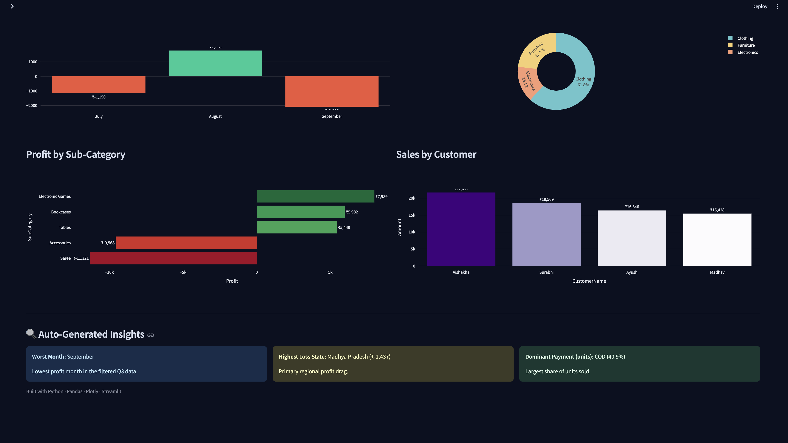

# E-Commerce Profitability & Risk Analysis

**Live dashboard:** [ecommerce-profitability-analysis.streamlit.app](https://ecommerce-profitability-analysis-9xdbhxp2iyfzjq3ypqq9tw.streamlit.app/)




Interactive Streamlit dashboard for a synthetic Q3 e-commerce dataset. Filters (state, category, payment mode) drive KPIs and Plotly charts so loss drivers are visible by region, payment mix, month, and SKU.

## Business problem

An e-commerce marketplace booked **₹72,000** in sales and **1,017** units in Q3 (July–September) but finished **₹1,469** in the red (AOV **₹480**). Leadership needed a clear view of which states, payment modes, and categories were producing that net loss.

This repo generates a 150-order synthetic dataset with planted Clothing / COD / Madhya Pradesh loss patterns, then serves it in a dashboard. A separate `analysis.sql` file ranks the same table with window functions (RFM-style scores, state health, payment risk, category concentration). SQL is **not** executed by the app — Streamlit uses pandas on the CSV.

## What the dashboard shows

- KPIs: total sales, units, profit, average order value
- Charts: sales by state, units by payment mode, profit by month, units by category, profit by sub-category, sales by customer
- Auto-insights: worst month, highest-loss state, dominant payment by units

## Key findings

Numbers below are from the generated `ecommerce_data.csv` (same figures the dashboard KPIs/charts use).

- **Regional mix:** Madhya Pradesh is the largest book of business (**₹30,249** sales, 63 orders) and a loss region (**₹−1,437**). Maharashtra is close behind on losses (**₹−1,428**) on less volume. Uttar Pradesh is the only clearly profitable state (**₹+2,297**). Kerala is smallest (**₹7,137** sales) with the weakest margin (−12.6%).
- **Payment risk:** COD is **42% of orders** and **41% of units**, and the largest payment-mode loss (**₹−2,988**). UPI is 22% of orders; Credit Card 15%. EMI is the profitable mode (**₹+3,116**).
- **Category imbalance:** Clothing is **61.8% of units** and the profit drag (**₹−20,889**). Furniture and Electronics are profitable. Loss sub-categories are Saree and Accessories; profitable sub-categories are Electronic Games, Bookcases, and Tables.
- **Monthly trend:** August is the only profitable month (**₹+1,776**). July is **₹−1,150**; September is the worst month (**₹−2,096**).

## Recommendations

1. **Cut COD exposure:** COD is the loss leader among payment modes. A prepaid incentive (for example a small UPI / card discount) is the direct lever.
2. **Do not treat Accessories as a margin hedge:** both Clothing sub-categories lose money. Pair Clothing with Furniture or Electronics, not with Accessories.
3. **Regional COD policy:** Madhya Pradesh (high volume, negative profit) and Maharashtra (similar absolute loss) are the states to constrain on high-value COD.

## Tech stack

- **Python:** Pandas, NumPy (generation and transforms)
- **Streamlit + Plotly:** dashboard and charts
- **SQL:** standalone window-function analysis on the same schema (no Recency column, so RFM is frequency / monetary / profit only — not a full RFM or cohort model)

## Repository

| File | Purpose |
|---|---|
| `generate_data.py` | Builds the 150-row synthetic CSV (seeded). Scales sales and units across all rows so totals stay ₹72,000 / 1,017 / ₹−1,469 without breaking individual orders. |
| `ecommerce_data.csv` | Generated dataset |
| `app.py` | Streamlit app (regenerates the CSV if it is missing) |
| `analysis.sql` | RFM-style segments, state rank, payment risk, category concentration |
| `requirements.txt` | Pinned Python dependencies |
| `runtime.txt` | Python 3.11 pin for Streamlit Cloud |
| `dashboard1.png` | Dashboard screenshot (KPIs and top charts) |
| `dashboard2.png` | Dashboard screenshot (sub-category, customers, insights) |

## Run locally

Python 3.11 recommended (matches `runtime.txt`).

```bash
python3 -m venv .venv
source .venv/bin/activate
pip install -r requirements.txt
python generate_data.py
streamlit run app.py
```

Streamlit Cloud: set the main file to `app.py`.

## Author

Ishika Kour — M.Tech Data Analytics, NIT Jalandhar | Ex-Philips Analytics | GATE CSE/DA Qualified
